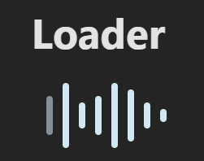
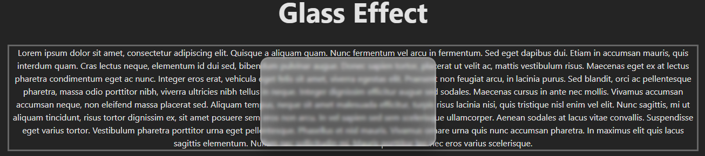

# SoundInfluencers — Frontend Test Task

This project contains two UI tasks completed as part of a Front-End test assignment.  
Both tasks were implemented using **React + Pure CSS**, based directly on a Figma design.

---

## 🎬 Part 1 — Animated Loader

A 9-bar “equalizer-style” loader reproduced from Figma using:

- CSS keyframes  
- nth-child animation delays  
- opacity-based wave sequence  
- adaptive, responsive layout  

No JavaScript animations or external libraries were used — animation is 100% CSS-driven.

### 📸 Preview  


## 🧊 Part 2 — Draggable Glassmorphism Overlay

A draggable glass-style UI element placed over text:

- Glassmorphism effect (blur, gradients, highlights)  
- `backdrop-filter` layered styling  
- Drag-and-drop implemented with `useRef`  
- Native DOM events for smooth 60–120 FPS interaction  
- Boundary constraints to keep the element inside the container  

### 📸 Preview 



## 🛠 Tech Stack

- React 18  
- Vite  
- CSS3  
- DOM events (`mousemove`, `mouseup`)  
- `useRef` for high-performance state  
- Figma → Pixel-perfect UI reproduction  

---

## 📁 Project Structure
src/

├── App.jsx              # Main application component

├── loader.css           # Styles for the animated loader

├── glass.css            # Styles for the glassmorphism effect

├── glass.jsx            # Draggable glass overlay component

├── App.css              # Global app styles

## 🚀 Running the Project

```bash
npm install
npm run dev
```

👤 Author

Mykyta Olshanskyi

Frontend Developer

GitHub: https://github.com/HuntGuter

LinkedIn: https://www.linkedin.com/in/huntguter/
